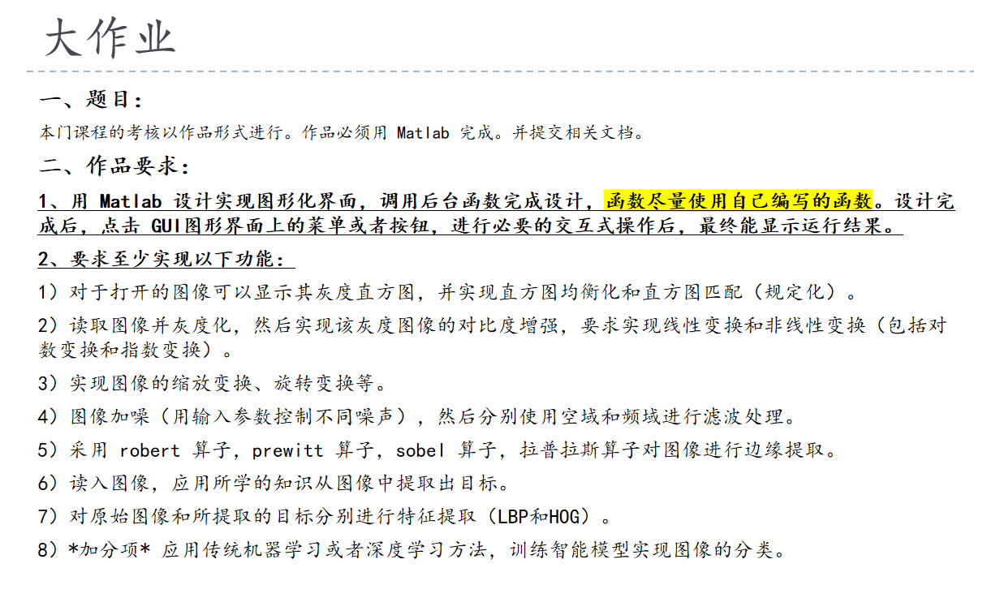

# Digital-Image-Processing

# 函数
## 对比度增强
线性变换
- linearTransform
非线性变换
- threeSegmentLinearTransform
- piecewiseLinearTransform
对数变换
- logTransform
指数变换
- expTransform

## 图像的缩放
- resizeColorImage
	- bilinearResize

## 图像旋转
- rotateImage
	- rotateSingleChannel
## 错切
- shearImageRGB

## 镜像
- horizontal_flip
- vertical_flip

## 噪声与滤波
椒盐
- addSaltAndPepperNoise
高斯
- addGaussianNoise

滤波
- 空域平滑滤波
	- meanFilter 均值
	- medianFilter中值
	- 高斯（function）
	- 双边滤波 bilateralFilter
- 频域平滑滤波
	- 理想低通滤波 idealLowPassFilter
	- 指数exponentialLowPassFilter
- 模糊技术 fuzzy_average_filter
## 边缘提取
- robert算子 robertEdgeDetection
- prewitt算子 prewittEdgeDetection
- sobel算子 sobelEdgeDetection
- 拉普拉斯算子 laplaceEdgeDetection
## 目标提取
- K-means聚类分割 
	- targetExtraction_KMeans
- 基于双峰分布的直方图选择阈值 
	- targetExtract_BimodalThresholding
- 分水岭分割+区域合并 
	- targetExtract_WatershedRegion
	

## LBP特征提取
- computeLBP

## HOG特征提取
- computeHOG

## 图像分类
- model_pred.py

